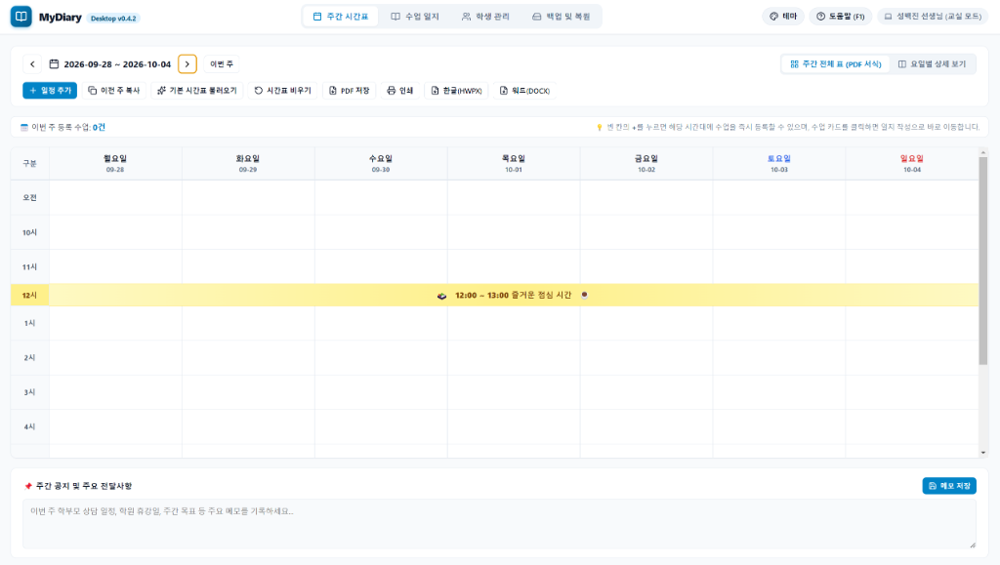
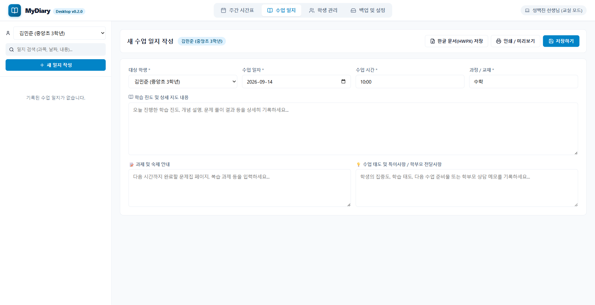
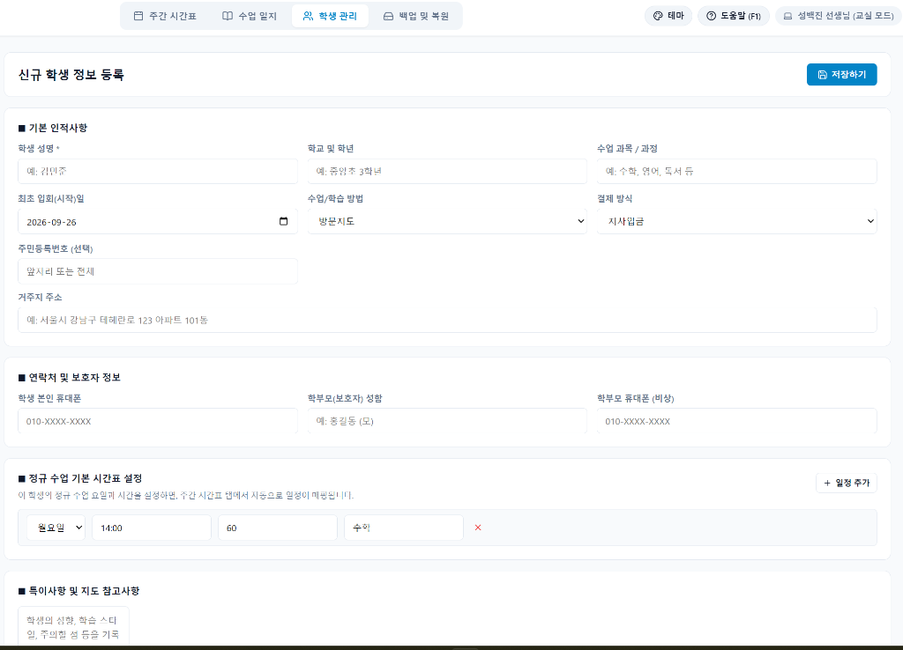
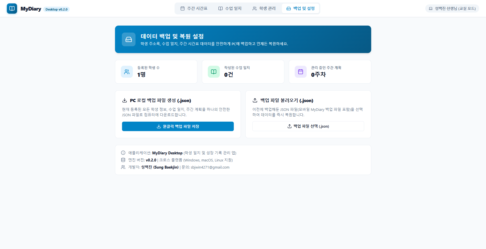

# MyDiary Desktop (v0.4.2)

선생님들을 위한 스마트 수업 일지 및 학생 성장 기록 관리 크로스 플랫폼 데스크톱 애플리케이션입니다.  
기존 스마트폰용 MyDiary 모바일 앱의 핵심 편의성과 데이터 호환성을 100% 계승하면서, 넓은 PC 모니터 화면에 특화된 와이드 시간표 매트릭스, 2열 마스터-디테일 에디터, 공문서 표준 한글(HWPX)/워드(DOCX) 내보내기, **스마트폰과 PC 간 구글 드라이브 원클릭 클라우드 데이터 동기화**, 그리고 **사용자 맞춤형 5대 다중 테마 시스템**을 제공합니다.

<p align="center">
  
</p>

---

## 📌 프로젝트 정보

- **버전**: `v0.4.2`
- **기획 및 개발자**: 성백진 (Sung Baekjin) <sbjwin4271@gmail.com>
- **지원 운영체제**: Windows 10/11, macOS, Linux (3대 OS 완벽 지원)
- **핵심 기술 스택**: Electron, React 19, Vite, Lucide-React, JSZip (HWPX OWPML 파서), Google OAuth 2.0 PKCE Loopback

---

## 🖥️ 핵심 화면 및 주요 기능 소개

### 1. ▦ 주간 시간표 매트릭스 & 대시보드 (Weekly Schedule)
<p align="center">
  
</p>

- **시간대별 주간 전체 표 (PDF 서식)**:
  - 세로 시간 축(오전 9시 ~ 저녁 8시)과 가로 7개 요일(월~일)을 한눈에 조망하는 와이드 매트릭스
  - **12:00 ~ 13:00 즐거운 점심 시간**: 가로 전체 병합 배너(🍱☕) 자동 표시
  - 오늘 날짜(Today) 강조 및 토/일 컬럼 색상 구분
- **원클릭 수업 등록(+) & 일지 양방향 연동**:
  - 빈 칸의 [+] 버튼을 누르면 요일과 시간이 자동 세팅되며 학생 선택 시 과목·연락처·주소가 자동 채워집니다.
  - 작성 완료된 수업 카드를 누르고 [수업 일지 작성]을 클릭하면 기존에 작성된 일지 내용을 자동으로 탐색하여 즉시 수정 모드로 연결됩니다.
- **다중 포맷 원클릭 내보내기**:
  - 상단 툴바를 통해 이번 주 전체 수업 일정 보고서를 **A4 인쇄**, **PDF 저장**, **공문서 표준 한글(*.hwpx)** 및 **워드(*.docx)** 파일로 즉시 출력할 수 있습니다.
- **듀얼 뷰 모드**: `[▦ 주간 전체 표 (PDF 서식)]` ↔ `[:= 요일별 상세 보기]` 원클릭 전환 지원

---

### 2. 📝 2열 마스터-디테일 수업 일지 (Class Diary)
<p align="center">
  
</p>

- **직관적인 2열 인터페이스**:
  - 좌측 학생 필터 및 과거 일지 카드 목록, 우측 일지 작성/수정 폼
  - 좌측 목록에서 지난 일지를 클릭하면 우측 폼에 기존 내용이 즉시 채워져 연속 수정 가능
- **체계적인 3대 영역 분할 기록**:
  - [학습 진도 및 지도 내용], [과제 및 숙제 안내], [수업 태도 및 특이사항 / 학부모 전달사항]을 구분하여 기록
- **공문서 표준 한글 문서(HWPX) 저장**:
  - 한글과컴퓨터 공식 OWPML 표준 XML 규격을 100% 준수하는 `*.hwpx` 파일로 PC 파일 탐색기에 즉시 저장
- **포커스 유지 & 토스트 알림**:
  - 번거로운 팝업 확인창 없이 부드러운 인라인 플로팅 토스트 알림이 뜨며, 입력 커서가 그대로 유지되어 끊김 없는 타이핑 보장

---

### 3. 👥 학생 및 수강 차수 관리 (Student Management)
<p align="center">
  
</p>

- **재원생 / 휴회생 탭 분리**: 상태별 맞춤형 목록 분류 및 실시간 이름 검색 지원
- **연락처 정규화**: 학생 및 학부모 전화번호 자동 정규화 `(본)010-XXXX`, `(모)010-XXXX`
- **정규 수업 기본 시간표 등록**:
  - 학생 프로필에 요일, 시작 시간, 수업 시간을 등록해 두면 매주 주간 시간표에 해당 학생의 수업 일정이 자동 스케줄링
- **수강 차수(Term) 이력 관리**:
  - 수강 기간별 1차, 2차 등 차수 시작일과 종료일, 해당 차수 동안 작성된 수업 일지 건수를 한눈에 확인하고 새 차수 시작

---

### 4. ☁️ 백업 및 설정 & 구글 드라이브 클라우드 동기화 (Backup & Settings)
<p align="center">
  
</p>

- **구글 드라이브 원클릭 클라우드 연동 (스마트폰 MyDiary 동기화)**:
  - 구글 계정으로 로그인한 뒤, 스마트폰 앱이 업로드한 `mydiary_backup.json`을 데스크톱으로 원클릭 복원하거나 데스크톱 데이터를 클라우드에 백업
- **PC 로컬 백업 파일 생성 및 복원 (.json)**:
  - 인터넷 연결 없이도 현재 등록된 모든 학생 정보, 수업 일지, 주간 계획을 PC 로컬 JSON 파일로 안전하게 다운로드 및 즉시 복원
- **보관 데이터 실시간 요약 통계**:
  - 등록된 학생 수, 작성된 수업 일지 수, 관리 중인 주간 계획 수를 직관적인 카드로 한눈에 확인
- **5가지 프리셋 컬러 테마 시스템**:
  - 오션 블루, 포레스트 세이지, 로열 라벤더, 웜 선셋, 미드나잇 다크 테마 지원 및 상단 헤더 퀵 팔레트 제공

---

## 🌟 v0.4.2 주요 신규 기능 및 기술 개선 사항

### 1. 🛡️ 프로젝트 전반 네이티브 다이얼로그 전수 제거 및 전역 인앱 다이얼로그 시스템 구축 (Zero Native Dialogs)
- **Windows Electron 포커스 잠김 및 키보드 입력 차단 결함 영구 근절**:
  - 브라우저 네이티브 `window.confirm()` 및 `alert()`로 인해 Chromium 렌더러 창이 키보드 입력 포커스를 잃어버리던 결함을 해결하기 위해 6개 파일 총 41건의 네이티브 팝업 전수 제거
- **인앱 확인 모달(`ConfirmModal.jsx`) & 전역 다이얼로그 유틸리티(`dialog.js`) 신규 도입**:
  - 비차단 방식으로 안전하게 알림 및 사용자 확인을 수행하는 감성 인앱 다이얼로그 구축
- **Electron Main & Preload 레벨 윈도우 포커스 보장 메커니즘**:
  - `focus-window` IPC 핸들러를 등록하여 모달 닫힘 후 OS 차원에서 메인 윈도우 포커스를 즉각 강제 복구

### 2. 📝 수업 일지 에디터 포커스 안정화 & 인라인 토스트 알림 도입
- **연속 타이핑 포커스 자동 복원**:
  - 저장 후 직전에 편집하던 입력 필드로 커서를 자동 복원하여 손을 뗄 필요 없는 연속 입력 지원
- **실시간 저장 마이크로 인터랙션**:
  - 저장 버튼 클릭 시 즉각적인 `✓ 저장 완료!` 피드백 애니메이션 및 토스트 알림 제공

### 3. 🎨 다중 감성 테마 시스템 & 2중 선택 GUI
- 5가지 프리셋 컬러 테마(오션 블루, 포레스트 세이지, 로열 라벤더, 웜 선셋, 미드나잇 다크) 및 실시간 CSS 변수 트랜지션 적용
- 헤더 퀵 팔레트 및 설정 탭 미니 창 프리뷰 카드를 통한 직관적 테마 변경

### 4. 🔐 Windows 자체 서명(Code Signing) 패키징 지원
- Windows SmartScreen 경고를 방지하는 자체 서명 인증서 자동 생성 및 로컬 등록 스크립트 제공
- 보안 인증서와 비밀번호를 환경 변수로 안전하게 주입하는 `npm run package:win:signed` 파이프라인 구축

---

## ⌨️ 단축키 안내

| 단축키 | 기능 |
| :--- | :--- |
| **`F1`** | 시각적 도움말 가이드 열기 |
| **`ESC`** | 열려 있는 모달 (수업 일정, 도움말 등) 닫기 |
| **`Ctrl + P`** | 현재 화면 / 주간 보고서 인쇄 및 PDF 저장 |

---

## 🚀 개발 환경 실행

```bash
# 1. 패키지 설치
npm install

# 2. 웹 브라우저 개발 서버 실행 (http://localhost:5173/)
npm run dev

# 3. Electron 데스크톱 앱으로 실행
npm run dev:electron
```

---

## 📦 OS별 데스크톱 앱 패키징 (.exe / .dmg / .AppImage)

```bash
# Windows 일반 빌드 (x64 NSIS 설치 파일 및 포터블 .exe)
npm run package:win

# Windows 자체 서명 코드사이닝 포함 빌드 (로컬/테스트 전용 추천)
npm run package:win:signed

# macOS (.dmg)
npm run package:mac

# Linux (.AppImage 및 .deb)
npm run package:linux
```

> 💡 **Windows SmartScreen 경고 대처 및 테스트 방법**:  
> 패키징 후 실행 시 윈도우 보안 경고(SmartScreen) 차단 해제 및 자체 서명 인증서 활용법은 [docs/WINDOWS_SMARTSCREEN_TEST_GUIDE.md](docs/WINDOWS_SMARTSCREEN_TEST_GUIDE.md) 문서를 참고하십시오.

---

## 📄 라이선스 및 저작권

Copyright © 2026 **Sung Baekjin (성백진)** <sbjwin4271@gmail.com>. All rights reserved.
